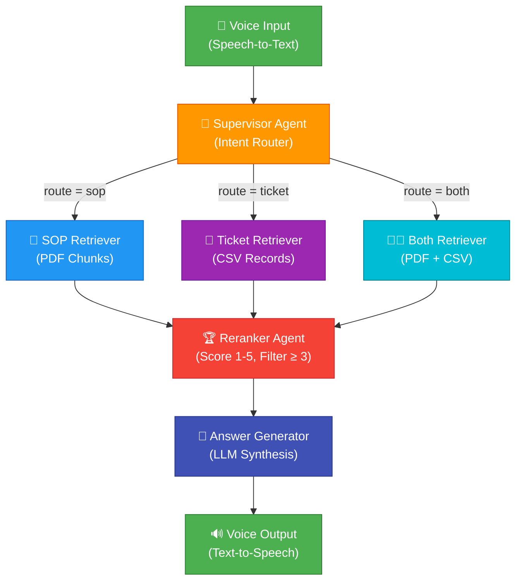

<div align="center">

# 🎙️ VoiceOps ITSM Intelligence Agent

### A Voice-Powered, AI-Driven IT Service Management Agent

[](https://python.org)
[](https://langchain.com)
[](https://langchain-ai.github.io/langgraph/)
[](https://ollama.com)
[](https://www.trychroma.com)

---

*An intelligent, voice-activated IT support agent that listens to spoken queries, routes them through a multi-agent LangGraph workflow, retrieves relevant information from SOP documents and historical ITSM tickets, and responds with synthesized, spoken answers — all running locally with no cloud API dependencies.*

</div>

---

## 📖 Table of Contents

- [About the Project](#-about-the-project)
- [Key Features](#-key-features)
- [Architecture Overview](#-architecture-overview)
- [Agent Workflow & Flow Diagram](#-agent-workflow--flow-diagram)
- [Tech Stack & Tools](#-tech-stack--tools)
- [Project Structure](#-project-structure)
- [Data Sources](#-data-sources)
- [Getting Started](#-getting-started)
  - [Prerequisites](#prerequisites)
  - [Installation](#installation)
  - [First-Time Setup: Data Ingestion](#first-time-setup-data-ingestion)
  - [Running the Agent](#running-the-agent)
- [How It Works](#-how-it-works)
- [Configuration](#-configuration)
- [Future Enhancements](#-future-enhancements)
- [License](#-license)

---

## 🎯 About the Project

**VoiceOps ITSM Intelligence Agent** is a fully local, privacy-first AI agent built for IT Service Management (ITSM) operations. It combines **voice interaction** (Speech-to-Text + Text-to-Speech) with a **Retrieval-Augmented Generation (RAG)** pipeline orchestrated by **LangGraph** to deliver intelligent, context-aware IT support.

The agent ingests two critical knowledge sources:

1. **SOP Documents (PDF)** — Standard Operating Procedures that define how specific IT issues should be resolved (e.g., VPN errors, database migrations, Active Directory lockouts).
2. **Historical ITSM Tickets (CSV)** — Real incident and change request records with resolution notes, enabling pattern-based diagnosis.

When a support engineer speaks a query, the system:
- Transcribes the voice input
- Intelligently routes the query to the right data source(s)
- Retrieves and re-ranks the most relevant documents
- Generates a precise, SOP-aligned answer
- Speaks the answer back aloud

This eliminates the need to manually search through ticket databases and SOP manuals, dramatically reducing **Mean Time to Resolution (MTTR)**.

---

## ✨ Key Features

| Feature | Description |
|---|---|
| 🎤 **Voice Input** | Captures spoken queries via microphone using `sounddevice` and Google Speech Recognition |
| 🔊 **Voice Output** | Reads AI-generated answers aloud using macOS native `say` TTS engine |
| 🧠 **Multi-Agent Routing** | A Supervisor agent intelligently routes queries to SOP, Ticket, or Both retrievers |
| 📄 **SOP-Aware RAG** | Semantic chunking of PDF SOPs ensures procedure-level retrieval accuracy |
| 🎫 **Ticket-Aware RAG** | Structured CSV ticket data is embedded with rich metadata for historical pattern matching |
| 🏆 **LLM-Powered Reranking** | A dedicated Reranker agent scores retrieved documents (1–5) and filters out noise |
| 🔒 **Fully Local** | Runs entirely on your machine — no data leaves your environment (Ollama + ChromaDB) |
| ⌨️ **Keyboard Fallback** | Gracefully falls back to typed input if voice capture fails |

---

## 🏗️ Architecture Overview

The system follows a **multi-agent RAG architecture** orchestrated by LangGraph's `StateGraph`. Each node in the graph is a specialized agent with a single responsibility:

```
┌─────────────────────────────────────────────────────────────────────┐
│                        VOICEOPS ITSM AGENT                        │
├─────────────────────────────────────────────────────────────────────┤
│                                                                     │
│   ┌──────────────┐     ┌────────────────────────────────────────┐  │
│   │  Voice Layer  │     │         LangGraph Orchestration        │  │
│   │              │     │                                        │  │
│   │  🎤 STT      │────▶│  Supervisor ──▶ Retriever ──▶ Reranker│  │
│   │  🔊 TTS      │◀────│                              ──▶ Gen  │  │
│   └──────────────┘     └────────────────────────────────────────┘  │
│                                    │                                │
│                          ┌─────────┴─────────┐                     │
│                          ▼                   ▼                     │
│                   ┌─────────────┐     ┌─────────────┐              │
│                   │  ChromaDB   │     │   Ollama     │              │
│                   │  (Vectors)  │     │  (Mistral +  │              │
│                   │             │     │   Nomic)     │              │
│                   └─────────────┘     └─────────────┘              │
│                                                                     │
└─────────────────────────────────────────────────────────────────────┘
```

### Component Breakdown

| Component | Role |
|---|---|
| **Voice Layer (STT/TTS)** | Captures microphone audio, transcribes via Google SR, and synthesizes speech output via macOS `say` |
| **LangGraph StateGraph** | Orchestrates the multi-agent pipeline with conditional routing and sequential edges |
| **Supervisor Agent** | Classifies the query intent and routes to the appropriate retriever (`sop`, `ticket`, or `both`) |
| **SOP Retriever Agent** | Queries ChromaDB with metadata filter `source_type: pdf` to fetch SOP procedure chunks |
| **Ticket Retriever Agent** | Queries ChromaDB with metadata filter `source_type: csv` to fetch historical ticket records |
| **Both Retriever Agent** | Runs both SOP and Ticket retrievers in parallel and merges results |
| **Reranker Agent** | Uses the LLM to score each document's relevance (1–5) and filters out documents scoring below 3 |
| **Answer Generator Agent** | Synthesizes a final, grounded answer from re-ranked documents and speaks it to the user |
| **ChromaDB** | Local vector database storing embedded document chunks with source-type metadata |
| **Ollama (Mistral)** | Local LLM for routing, reranking, and answer generation |
| **Ollama (Nomic Embed Text)** | Local embedding model for semantic vectorization of documents and queries |

---

## 🔄 Agent Workflow & Flow Diagram

The following diagram illustrates the complete query-to-answer flow:



### Step-by-Step Flow

| Step | Agent | Description |
|------|-------|-------------|
| 1 | **Voice Input (STT)** | User speaks a query. The system records 5 seconds of audio at 16kHz, transcribes it using Google Speech Recognition. Falls back to keyboard input on failure. |
| 2 | **Supervisor** | The transcribed query is passed to the Supervisor, which uses Mistral (via structured output) to classify the query as `sop`, `ticket`, or `both`. |
| 3 | **Retriever(s)** | Based on the route, the appropriate retriever queries ChromaDB with metadata filters, returning the top-k most semantically similar documents. |
| 4 | **Reranker** | Each retrieved document is individually scored for relevance (1–5) by the LLM. Documents scoring ≥ 3 are kept; the rest are discarded. |
| 5 | **Answer Generator** | The filtered documents are formatted and passed to the LLM with an IT Support Agent system prompt. The LLM generates a grounded answer using **only** the retrieved information. |
| 6 | **Voice Output (TTS)** | The generated answer is printed to the console and spoken aloud using macOS `say` at 220 WPM. |

---

## 🛠️ Tech Stack & Tools

### Core Framework

| Technology | Purpose | Version/Model |
|---|---|---|
| [**Python**](https://python.org) | Core programming language | 3.10+ |
| [**LangChain**](https://langchain.com) | LLM application framework — prompts, chains, output parsers, document loaders | Latest |
| [**LangGraph**](https://langchain-ai.github.io/langgraph/) | Multi-agent workflow orchestration via `StateGraph` | Latest |
| [**Ollama**](https://ollama.com) | Local LLM inference server | — |

### Models (Running Locally via Ollama)

| Model | Role |
|---|---|
| **Mistral** | LLM for routing, reranking, and answer generation |
| **Nomic Embed Text** | Embedding model for semantic vectorization |

### Data & Retrieval

| Technology | Purpose |
|---|---|
| [**ChromaDB**](https://www.trychroma.com) | Local persistent vector database for document embeddings |
| [**LangChain SemanticChunker**](https://python.langchain.com/docs/how_to/semantic-chunker/) | Semantically-aware PDF document splitting |
| [**PyPDFLoader**](https://python.langchain.com/docs/integrations/document_loaders/pypdf/) | PDF document loading and parsing |
| [**Pandas**](https://pandas.pydata.org) | CSV data loading and structured document creation |

### Voice I/O

| Technology | Purpose |
|---|---|
| [**SoundDevice**](https://python-sounddevice.readthedocs.io/) | Microphone audio capture (16kHz, mono, int16) |
| [**SpeechRecognition**](https://pypi.org/project/SpeechRecognition/) | Speech-to-Text via Google Speech Recognition API |
| **macOS `say`** | Text-to-Speech via native macOS command |

### Data Validation

| Technology | Purpose |
|---|---|
| [**Pydantic**](https://docs.pydantic.dev/) | Structured output schemas for routing (`Route`) and reranking (`RelevanceScore`) |

---

## 📁 Project Structure

```
VoiceOps-ITSM-Agent/
│
├── Voice-Ops_Intelligence_Agent.py    # Main application — all agents, graph, and voice I/O
├── historical_itsm_tickets.csv        # Historical ITSM ticket data (55 records)
├── ITSM Agent Data Generation - Google Gemini.pdf  # SOP document (procedures & manuals)
├── README.md                          # This file
└── .git/                              # Git version control
```

| File | Description |
|------|-------------|
| `Voice-Ops_Intelligence_Agent.py` | The complete application containing: data ingestion pipeline, 6 LangGraph agent nodes, voice capture/playback, and the compiled workflow. |
| `historical_itsm_tickets.csv` | 55 historical IT incident and change request records spanning Oct 2023 – May 2024, covering Network, Identity, Database, Infrastructure, and Middleware categories. |
| `ITSM Agent Data Generation - Google Gemini.pdf` | Standard Operating Procedure (SOP) document containing resolution procedures for VPN errors, Active Directory lockouts, database migrations, firmware upgrades, and middleware patching. |

---

## 📊 Data Sources

### Historical ITSM Tickets (`historical_itsm_tickets.csv`)

Contains **55 real-world-style records** with the following schema:

| Column | Description | Example |
|--------|-------------|---------|
| `TicketID` | Unique identifier | `INC-10001`, `CR-20001` |
| `CreationDate` | When the ticket was raised | `2023-10-14 08:15:00` |
| `ResolutionDate` | When the ticket was resolved | `2023-10-14 08:45:00` |
| `Status` | Resolution status | `Closed`, `Failed` |
| `Category` | ITSM category | `Network`, `Identity`, `Database`, `Infrastructure`, `Middleware` |
| `System` | Affected system | `GlobalProtect VPN`, `Active Directory`, `PostgreSQL`, `Cisco Nexus`, `WebLogic` |
| `Version` | Software/firmware version | `6.1.2`, `15.2`, `14.1.1` |
| `Issue_Summary` | Brief description of the issue | `Error 45 when connecting from home wifi` |
| `Resolution_Notes` | How the issue was resolved | `Instructed user to update MTU to 1350` |
| `SOP_Reference` | Referenced SOP document | `SOP-NET-088`, `SOP-IDM-012` |

### SOP Document (`ITSM Agent Data Generation - Google Gemini.pdf`)

Standard Operating Procedures covering:
- **SOP-NET-088** — GlobalProtect VPN troubleshooting (Error 45, Error 99, version upgrades)
- **SOP-IDM-012** — Active Directory identity management (AuthErr-774, 775, 779)
- **SOP-DB-004** — PostgreSQL database migrations and performance tuning
- **SOP-INF-045** — Cisco Nexus firmware upgrade procedures
- **SOP-APP-009** — WebLogic middleware patching and recovery

---

## 🚀 Getting Started

### Prerequisites

1. **Python 3.10+** installed
2. **Ollama** installed and running locally ([Install Ollama](https://ollama.com/download))
3. **macOS** (required for the native `say` TTS command)
4. A working **microphone** for voice input

### Installation

1. **Clone the repository:**
   ```bash
   git clone https://github.com/<your-username>/VoiceOps-ITSM-Agent.git
   cd VoiceOps-ITSM-Agent
   ```

2. **Install Python dependencies:**
   ```bash
   pip install langchain langchain-ollama langchain-community langchain-chroma \
               langchain-experimental langchain-text-splitters langgraph \
               pydantic pandas sounddevice SpeechRecognition pypdf chromadb
   ```

3. **Pull the required Ollama models:**
   ```bash
   ollama pull mistral
   ollama pull nomic-embed-text
   ```

### First-Time Setup: Data Ingestion

Before running the agent, you must ingest the SOP document and ticket data into the local ChromaDB vector store.

1. Open `Voice-Ops_Intelligence_Agent.py`
2. **Uncomment** line 119:
   ```python
   ingest_documents("ITSM Agent Data Generation - Google Gemini.pdf", "historical_itsm_tickets.csv")
   ```
3. Run the script once:
   ```bash
   python Voice-Ops_Intelligence_Agent.py
   ```
4. **Re-comment** line 119 after ingestion completes (to avoid re-ingesting on every run).

### Running the Agent

```bash
python Voice-Ops_Intelligence_Agent.py
```

The agent will:
1. Initialize the LLM and vector store
2. Begin listening for your voice query (5-second recording window)
3. If voice capture fails, prompt for keyboard input
4. Process the query through the full LangGraph pipeline
5. Speak the answer aloud

**Example queries you can ask:**
- *"How do I fix VPN Error 45?"*
- *"Show me recent Active Directory lockout tickets"*
- *"What is the SOP for PostgreSQL migration and were there any failures?"*

---

## ⚙️ Configuration

Key configurable parameters in the script:

| Parameter | Default | Description |
|-----------|---------|-------------|
| `SAMPLE_RATE` | `16000` | Audio recording sample rate (Hz) |
| `RECORD_DURATION` | `5` | Duration of voice recording (seconds) |
| `llm model` | `mistral` | Ollama LLM model for reasoning |
| `embeddings model` | `nomic-embed-text` | Ollama embedding model for vectorization |
| `retriever k` | `4` | Number of documents to retrieve per query |
| `reranker threshold` | `≥ 3` | Minimum relevance score (1–5) to keep a document |
| `persist_directory` | `/tmp/VoiceOps_chroma_db` | ChromaDB storage location |
| `TTS rate` | `220` WPM | macOS `say` command speech rate |

---

## 🔮 Future Enhancements

- [ ] **Cross-platform TTS** — Replace macOS `say` with `pyttsx3` or `edge-tts` for Windows/Linux support
- [ ] **Streaming voice input** — Continuous listening with wake-word detection (e.g., "Hey Agent")
- [ ] **Chat history** — Maintain conversational context across multiple queries using `InMemoryChatMessageHistory`
- [ ] **Web UI** — Add a Streamlit or Gradio dashboard for visual interaction alongside voice
- [ ] **Ticket creation** — Enable the agent to create new ITSM tickets based on voice-described issues
- [ ] **Multi-model support** — Allow swapping in different Ollama models (e.g., `llama3`, `phi3`) via config
- [ ] **Evaluation pipeline** — Automated RAGAS-based evaluation of retrieval and generation quality

---

## 📄 License

This project is open source and available under the [MIT License](LICENSE).

---

<div align="center">

**Built with ❤️ using LangChain, LangGraph, Ollama, and ChromaDB**

*Empowering IT support engineers with voice-first, AI-driven intelligence — fully local, fully private.*

</div>
